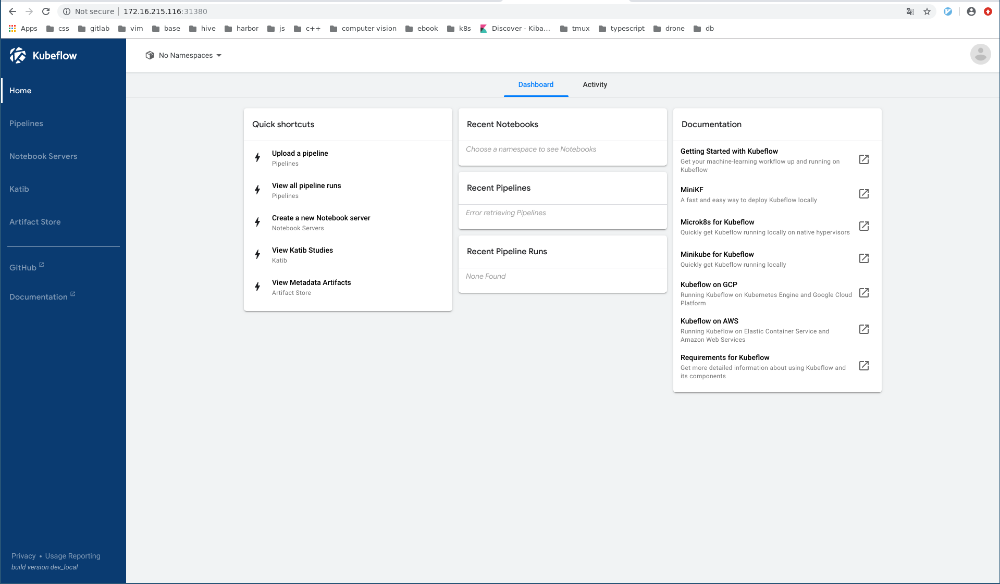
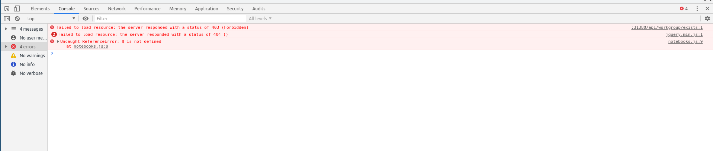

# kubeflow UI
本小节主要来源于[官网教程](https://www.kubeflow.org/docs/other-guides/accessing-uis/). 

kubeflow包括许多web UIs. 本文档重点关于如何连接使用这些UI.

## Kubeflow UIs概览

* central **Kubeflow** UIs : 用于在kubeflow 应用中导航.
* **Pipelines**: kubeflow piplines dashboad
* **Notebook Servers**: 用于管理jupyter notebooks.
* **Kartib**: 用于调节超参数
* **Artifact Store**: for tracking of artifact metadata.

我们在172.16.215.116上的central Kubeflow UIs访问地址:http://172.16.215.116:31380, 如下图:

# [Set Up Your Notebooks](https://www.kubeflow.org/docs/notebooks/setup/)

This guide shows you how to set up a notebook server for your Jupyter notebooks in Kubeflow.

## Quick guide

1. 打开central Kubeflow UI,我们的地址为: http://172.16.215.116:31380
1. 在Kubeflow UI左边的面板上点击 **Notebook Servers**
1. 需要选择namespace
1. 点击**NEW SERVER** 来创建notebook server.
1. 当notebook server启动完成， 点击**CONNET**
1. 点击**Upload**上传一个已经存在的notebook,或者点击**New**来新建一个空的notebook文件。

## Create a Jupyter notebook server and add a notebook
1. 首先在**Kubeflow UI**左边的面板上点击**Notebook Servers**，访问部署在kubeflow上的jupyter notebook服务。

1. 登录，但是我们的测试集群不用认证，跳过。
1. 选择一个namespace,这里我们选择“knative-serving”:
  * 点击namespace下拉列表查看可选的namespaces.
  * 选择一个namespace

1. 点击**NEW SERVER**:

  
  
  接着我们进入了创建server的详细配置界面， 下面是部分截图：
  
  
  
 1.输入server name.
 
 1. kubeflow会自动创建好notebook server，然后我们点击`connect`
 
 
  

## TroubleShouting
1. /api/workgroup/existing报错403
1. js库无法从google上拉取下来

问题1: 看着像$(namespace)这个没有替换成该变量的值的造成,将 **$(namespace)** 改成 **kubeflow**

